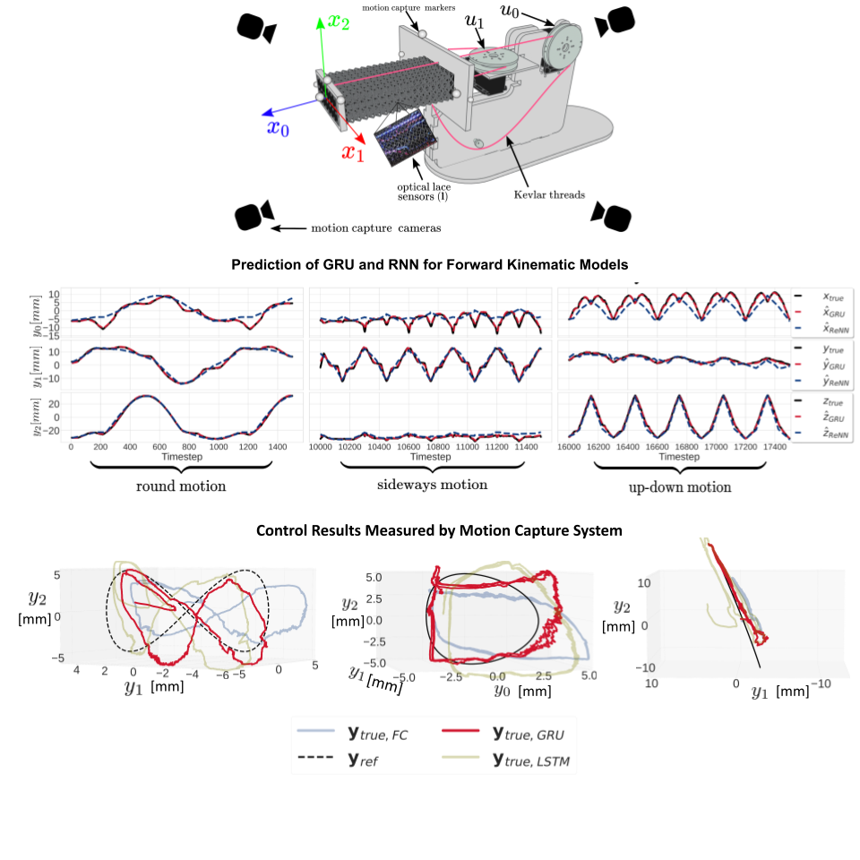

### Research

My current interest is the deployment of learning, modeling and control onto soft 
robots that do not allow powerful computers in their payload. 
This requires rethinking our modeling, control and learning methods in order 
to deploy less memory-hungry brains on our soft robots. I build algorithms that allow 
robotic materials to perform online predictions, controls and online learning in a 
computationally restricted environment such as an off-the-shelf microcontroller to 
solve problems related to interactions with the physical environment. The ultimate 
goal of this research is to develop a network of distributed learners able to make 
local updates to their knowledge base.

#### High-bandwidth nonlinear control for soft actuators with recursive network models (ISER 2020)

### Publications

#### Conferences and Proceedings:

- **Aguasvivas Manzano, S.**,  Xu,  P.,  Ly,  K.,  Shepherd,  R.,  Correll,  N.  High-bandwidth nonlinear control for soft actuators with recursive network models (ISER 2020). Accepted for Publication. [Link to arxiv](https://arxiv.org/abs/2101.01139)
- **Aguasvivas Manzano, S.**, Hughes, D., Simpson, C., Patel, R., Correll, N. “Embedded Neural Networks for Robot Autonomy.” International Symposium on Robotics Research (2019). [Link to arvix](https://arxiv.org/abs/1911.03848) [nn4mc.com](https://nn4mc.com/)
- **Aguasvivas Manzano, S.**, Correll, N. “In-situ Deep Learning for Prediction and Controls in Smart Composites.” 22nd International Conference on Composites Materials (2019). Presentation [Link to demo](https://www.youtube.com/watch?time_continue=12&v=0X3X-foe6hc)
- Hava, H., Zhou, L., Lombardi, L., Cui, K., Joung, H., **Aguasvivas Manzano, S.**, et.al. “SIRONA: Sustainable Integration of Regenerative Outer-space Nature and Agriculture. Part I.” Architecture and Technology Session. International Conference on Environmental Systems (2019) [Link](https://ttu-ir.tdl.org/handle/2346/84413)
- **Aguasvivas Manzano, S.**, Hughes, D., Correll, N. “Wireless Online Impact Source Localization on a Composite.” 4th International Conference on System-Integrated Intelligence (2018) [Link](https://www.youtube.com/watch?v=0UA5F83giOA)
- Basu, K., Melton, R., **Aguasvivas Manzano, S.** “Time-Optimal Reorientation using Neural Networks and Particle Swarm Formulation.” AAS/AIAA Astrodynamics Specialist Conference Columbia River Gorge, Stevenson, WA (2017) [Link](http://www.univelt.com/book=6408)
- **Aguasvivas Manzano, S.**, Lavely, A., Vijayakumar, G., Brasseur, J., Schmitz, S. “Nonsteady Wind Turbine Loading Response to Passage of Daytime Atmospheric Turbulence Eddies.” Annual Meeting of the APS Division of Fluid Dynamics 68 (2015)
) [Link](https://www.youtube.com/watch?v=0UA5F83giOA)
- **Aguasvivas Manzano, S.**, Jha, P., Plummer, J., and Schmitz, S. "Turbulent Transport in the Wakes of Wind Turbines." Annual Meeting of the APS Division of Fluid Dynamics 67 (2014) [Link](https://www.youtube.com/watch?v=2V_Vn-EWB5Q&t=82s)

#### Theses:

- **Aguasvivas Manzano, S.** Performance and Parsimony in Training Deep Neural Networks. Aerospace Engineering Department. The Pennsylvania State University. Masters Thesis (2017). [Link to repo](https://github.com/sarahaguasvivas/my_own_neural_network), [Link to demo](https://www.youtube.com/watch?v=GtuhoghSXg0&t=), [Link to thesis](https://etda.libraries.psu.edu/catalog/13814sia5396)
- **Aguasvivas Manzano, S.** Corrections to the BEMT Method for Highly Loaded Wind Turbine Blades. Aerospace Engineering Department. The Pennsylvania State University. Undergraduate Thesis (2015).

### Relevant Repositories

- **nn4mc: [nn4mc.com](https://nn4mc.com/)** Correll Lab's Neural Network for Microcontrollers [nn4mc](https://github.com/correlllab/nn4mc)
- **Nonlinear MIMO MPC Controller for Soft Robots with Soft Embedded Sensors:** 
    [link to repo](https://github.com/sarahaguasvivas/gpc_controller)

### CV

[Sarah's CV (Last Updated October 2020)](https://github.com/sarahaguasvivas/sarahaguasvivas.github.io/blob/master/docs/CV_AguasvivasManzano_Sarah.pdf)

### Current and Past Projects

TODO

### Sarah's Lab Notes:

Here I keep things that were hard to figure out for me: 
[Installing VRPN in Python3.X](https://github.com/sarahaguasvivas/sarahaguasvivas.github.io/blob/master/lab_notes/vrpn_client.md)

### Media Links
- [NASA BigIdea SIRONA Team](https://www.colorado.edu/engineering/2019/05/30/all-woman-engineering-team-earns-most-innovative-award-nasa-mars-competition)
- [CU Boulder CS Highlights](https://www.colorado.edu/cs/2018/09/13/joke-him-i-still-live-my-life-sometimes-dangerously-optimistic-sarah-aguasvivas-manzano)

### Things I believe will exist in 30 years
- Organic computers, that is, logic gates made from organic matter
- VR-enabled fully-immersive language learning experiences
